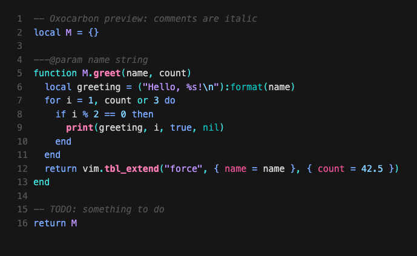
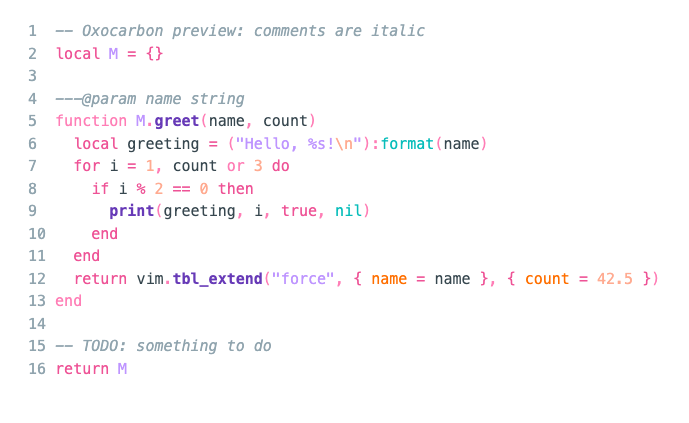

# oxocarbon.theme

Ports of the [oxocarbon](https://github.com/nyoom-engineering/oxocarbon.nvim) color
scheme, a dark and light theme inspired by
[IBM Carbon](https://carbondesignsystem.com/guidelines/color/overview/#themes), to
Neovim, terminals and CLI tools. Every port is generated from one palette, so the
colors match across tools.

<table width="100%">
  <tr>
    <th>Dark</th>
    <th>Light</th>
  </tr>
  <tr>
    <td width="50%"></td>
    <td width="50%"></td>
  </tr>
</table>

## Ports

### Neovim

The Neovim colorscheme supports 68 plugins and has `dark` and `light` styles. With
[lazy.nvim](https://github.com/folke/lazy.nvim):

```lua
{ "whispcat/oxocarbon.theme", main = "oxocarbon", lazy = false, priority = 1000, opts = {} }
```

See [docs/neovim.md](docs/neovim.md) for other installation methods,
configuration and the plugin list.

### Other tools

Each tool has a `dark` and a `light` theme in its directory under [extras](extras/),
named `oxocarbon_dark` and `oxocarbon_light` with the tool's file extension. The
tool's own documentation explains where the file goes. Directories with a
`README.md`, such as [Ghostty](extras/ghostty/README.md) and
[Zed](extras/zed/README.md), have setup steps.

<!-- extras:start -->

| Tool | Extra |
| --- | --- |
| [Aerc](https://git.sr.ht/~rjarry/aerc/) | [extras/aerc](extras/aerc) |
| [Aider](https://aider.chat) | [extras/aider](extras/aider) |
| [Alacritty](https://github.com/alacritty/alacritty) | [extras/alacritty](extras/alacritty) |
| [Btop++](https://github.com/aristocratos/btop) | [extras/btop](extras/btop) |
| [Delta](https://github.com/dandavison/delta) | [extras/delta](extras/delta) |
| [(Better-)Discord](https://betterdiscord.app/) | [extras/discord](extras/discord) |
| [Dunst](https://dunst-project.org/) | [extras/dunst](extras/dunst) |
| [eza](https://eza.rocks) | [extras/eza](extras/eza) |
| [Fish](https://fishshell.com/docs/current/index.html) | [extras/fish](extras/fish) |
| [Fish Themes](https://fishshell.com/docs/current/interactive.html#syntax-highlighting) | [extras/fish_themes](extras/fish_themes) |
| [Foot](https://codeberg.org/dnkl/foot) | [extras/foot](extras/foot) |
| [Fuzzel](https://codeberg.org/dnkl/fuzzel) | [extras/fuzzel](extras/fuzzel) |
| [Fzf](https://github.com/junegunn/fzf) | [extras/fzf](extras/fzf) |
| [Gemini CLI](https://github.com/google-gemini/gemini-cli) | [extras/gemini_cli](extras/gemini_cli) |
| [Ghostty](https://github.com/ghostty-org/ghostty) | [extras/ghostty](extras/ghostty) |
| [GitUI](https://github.com/extrawurst/gitui) | [extras/gitui](extras/gitui) |
| [GNOME Terminal](https://gitlab.gnome.org/GNOME/gnome-terminal) | [extras/gnome_terminal](extras/gnome_terminal) |
| [Helix](https://helix-editor.com/) | [extras/helix](extras/helix) |
| [iSH ](https://ish.app) | [extras/ish](extras/ish) |
| [iTerm](https://iterm2.com/) | [extras/iterm](extras/iterm) |
| [Kitty](https://sw.kovidgoyal.net/kitty/conf.html) | [extras/kitty](extras/kitty) |
| [Konsole](https://konsole.kde.org/) | [extras/konsole](extras/konsole) |
| [Lazygit](https://github.com/jesseduffield/lazygit) | [extras/lazygit](extras/lazygit) |
| [Lua Table for testing](https://www.lua.org) | [extras/lua](extras/lua) |
| [opencode](https://github.com/sst/opencode) | [extras/opencode](extras/opencode) |
| [pi](https://github.com/badlogic/pi-mono) | [extras/pi](extras/pi) |
| [Prism](https://prismjs.com) | [extras/prism](extras/prism) |
| [process-compose](https://f1bonacc1.github.io/process-compose/) | [extras/process_compose](extras/process_compose) |
| [QTerminal](https://github.com/lxqt/qterminal) | [extras/qterminal](extras/qterminal) |
| [Slack](https://slack.com) | [extras/slack](extras/slack) |
| [Spotify Player](https://github.com/aome510/spotify-player) | [extras/spotify_player](extras/spotify_player) |
| [Sublime Text](https://www.sublimetext.com/docs/themes) | [extras/sublime](extras/sublime) |
| [Tailwind CSS (v4)](https://tailwindcss.com) | [extras/tailwindv4](extras/tailwindv4) |
| [Terminator](https://gnome-terminator.readthedocs.io/en/latest/config.html) | [extras/terminator](extras/terminator) |
| [Termux](https://termux.dev/) | [extras/termux](extras/termux) |
| [Tilix](https://github.com/gnunn1/tilix) | [extras/tilix](extras/tilix) |
| [Tmux](https://github.com/tmux/tmux/wiki) | [extras/tmux](extras/tmux) |
| [Vim](https://vimhelp.org/) | [extras/vim](extras/vim) |
| [Vimium](https://vimium.github.io/) | [extras/vimium](extras/vimium) |
| [Vivaldi](https://vivaldi.com) | [extras/vivaldi](extras/vivaldi) |
| [WezTerm](https://wezfurlong.org/wezterm/config/files.html) | [extras/wezterm](extras/wezterm) |
| [Windows Terminal](https://aka.ms/terminal-documentation) | [extras/windows_terminal](extras/windows_terminal) |
| [Xfce Terminal](https://docs.xfce.org/apps/terminal/advanced) | [extras/xfceterm](extras/xfceterm) |
| [Xresources](https://wiki.archlinux.org/title/X_resources) | [extras/xresources](extras/xresources) |
| [Yazi](https://github.com/sxyazi/yazi) | [extras/yazi](extras/yazi) |
| [Zathura](https://pwmt.org/projects/zathura/) | [extras/zathura](extras/zathura) |
| [Zed](https://zed.dev) | [extras/zed](extras/zed) |
| [Zellij](https://zellij.dev/) | [extras/zellij](extras/zellij) |

<!-- extras:end -->

## Palette

All ports use these colors, under the base16-style slot names from oxocarbon.nvim.
`blend` is the background of floating windows and sidebars.

<!-- palette:start -->

| Slot | Dark | Light |
| --- | --- | --- |
| `base00` |  `#161616` |  `#ffffff` |
| `base01` |  `#262626` |  `#f2f2f2` |
| `base02` |  `#393939` |  `#d0d0d0` |
| `base03` |  `#525252` |  `#161616` |
| `base04` |  `#d0d0d0` |  `#37474f` |
| `base05` |  `#f2f2f2` |  `#90a4ae` |
| `base06` |  `#ffffff` |  `#525252` |
| `base07` |  `#08bdba` |  `#08bdba` |
| `base08` |  `#3ddbd9` |  `#ff7eb6` |
| `base09` |  `#78a9ff` |  `#ee5396` |
| `base10` |  `#ee5396` |  `#ff6f00` |
| `base11` |  `#33b1ff` |  `#0f62fe` |
| `base12` |  `#ff7eb6` |  `#673ab7` |
| `base13` |  `#42be65` |  `#42be65` |
| `base14` |  `#be95ff` |  `#be95ff` |
| `base15` |  `#82cfff` |  `#ffab91` |
| `blend` |  `#131313` |  `#fafafa` |

<!-- palette:end -->

A few choices apply to every port:

- Oxocarbon has no yellow or orange. Tools that ask for them get other palette
  colors: in dark, orange is pink `base12` and yellow is green `base13`.
- Terminal (ANSI) colors copy oxocarbon.nvim's mapping unchanged, so ANSI red is
  `base11`, a blue.
- The light style draws comments in gray `base05`. oxocarbon.nvim uses near-black
  `base03`, which makes comments and shell autosuggestions look like code.

## Development

```sh
./scripts/test   # run the test suite
./scripts/build  # regenerate extras/
./scripts/docs   # regenerate the generated tables in README.md and docs/neovim.md
```

The palettes are in `lua/oxocarbon/colors/`. Each port in `extras/` has a generator
in `lua/oxocarbon/extra/<tool>.lua`, listed in `lua/oxocarbon/extra/init.lua`, and
`./scripts/build` writes its output for both styles. CI fails when `extras/` is out
of date, so commit the regenerated files along with any palette or generator
change.

The tests check that every generator renders both styles without unresolved
placeholders or undefined colors.

The Neovim colorscheme lives at the repository root (`lua/`, `colors/`) because
plugin managers load it from there. If you open this repo with lazy.nvim, it loads
`.lazy.lua`, which reloads the theme on save and shows color swatches inline.

## Credits

- [oxocarbon.nvim](https://github.com/nyoom-engineering/oxocarbon.nvim) by
  [shaunsingh](https://github.com/shaunsingh) and the nyoom-engineering team: the
  color scheme (MIT).
- [tokyonight.nvim](https://github.com/folke/tokyonight.nvim) by
  [folke](https://github.com/folke): the plugin architecture and extra generators
  (Apache-2.0).

See [NOTICE](NOTICE).

## License

[Apache-2.0](LICENSE)
